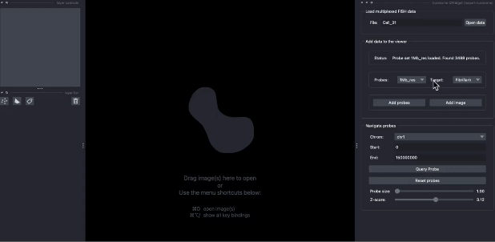

# napari-nucleome

A simple plugin to visualize multi-plexed FISH data to explore the 3D genome organization and make interactive exploration with multi-modal data hosted in Nucleome Browser.

----------------------------------

This [napari] plugin was generated with [Cookiecutter] using [@napari]'s [cookiecutter-napari-plugin] template.

<!--
Don't miss the full getting started guide to set up your new package:
https://github.com/napari/cookiecutter-napari-plugin#getting-started

and review the napari docs for plugin developers:
https://napari.org/stable/plugins/index.html
-->

## Installation

You can install `napari-nucleome` via [pip]:

    pip install napari-nucleome

## Introduction
Napari-nucleome is a plugin for napari to visulize multi-plexed FISH data (eg., DNA seqFISH+ data generated in Takei et al., Nature 2021) in napari. This plugin allows users to perform interactive exploration of multi-modal datasets, including imaging, multi-omics and 3D genome structure models for studying the cell nucleus. 

## Demo

The following animation demostrates the use case of explorting DNA seqFISH+ data in napari. Users can query probes by their genomic position, switch different targets, and choose different visualization parameters.

## Contributing

Contributions are very welcome. Tests can be run with [tox], please ensure
the coverage at least stays the same before you submit a pull request.

## License

Distributed under the terms of the [MIT] license,
"napari-nucleome" is free and open source software

## Issues

If you encounter any problems, please [file an issue] along with a detailed description.

[napari]: https://github.com/napari/napari
[Cookiecutter]: https://github.com/audreyr/cookiecutter
[@napari]: https://github.com/napari
[MIT]: http://opensource.org/licenses/MIT
[BSD-3]: http://opensource.org/licenses/BSD-3-Clause
[GNU GPL v3.0]: http://www.gnu.org/licenses/gpl-3.0.txt
[GNU LGPL v3.0]: http://www.gnu.org/licenses/lgpl-3.0.txt
[Apache Software License 2.0]: http://www.apache.org/licenses/LICENSE-2.0
[Mozilla Public License 2.0]: https://www.mozilla.org/media/MPL/2.0/index.txt
[cookiecutter-napari-plugin]: https://github.com/napari/cookiecutter-napari-plugin

[napari]: https://github.com/napari/napari
[tox]: https://tox.readthedocs.io/en/latest/
[pip]: https://pypi.org/project/pip/
[PyPI]: https://pypi.org/
